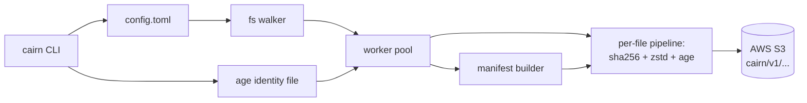
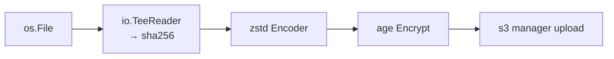

# Cairn Design (Descriptive)

This document records product and format **design intent** for `cairn`, including **why** major choices were made. **Normative** bucket layout, JSON field rules, and recovery steps are in [`format/FORMAT.md`](../format/FORMAT.md). A working config skeleton is in [`examples/config.toml`](../examples/config.toml).

Guiding principle: **simpler beats clever** — every section should be defensible against “could we just not do this?”

## Scope and Principles

- Personal, zero-trust backup tool targeting **AWS S3 only** (no alternate backends in v1).
- Per-file stream pipeline: `read → sha256 → zstd → age → S3`. The bucket sees opaque ciphertext under random object IDs inside `cairn/v1/`.
- **No shelling out** for core operations: encryption, compression, hashing, and S3 I/O use native Go libraries. `cairn keygen` exists so operators need not install `age-keygen` for bootstrap.
- Simplicity first: avoid optional complexity unless it materially improves correctness or long-term recoverability.

## Platform and Language

- **Language: Go.** Rationale: `filippo.io/age` is the **reference** implementation; AWS SDK v2 is mature; a **single static binary** is the most durable artifact; goroutines suit a bounded upload pool; cross-compilation to `linux/darwin/windows × amd64/arm64` is straightforward. Go’s compatibility promise helps the “recover years later” goal.
- Alternatives considered: **Rust** (strong static guarantees, but `age` is a re-implementation; slower iteration for a small tool). **Python** (bindings and env fragility are poor fit for long-horizon recovery and a small dependency surface).
- **OS targets:** Linux, macOS, Windows — one binary per `GOOS/GOARCH`, stdlib-first (`os`, `path/filepath`; `golang.org/x/sys/windows` only where unavoidable).

### Implementation stack (beyond third-party modules)

- **CLI:** stdlib `flag` plus a small subcommand dispatcher. **Rejected:** `cobra` / `viper` (~50+ transitive deps for ~six subcommands); heavier CLI frameworks are avoidable here.
- **Logging:** `log/slog`. **Hashing:** `crypto/sha256`.
- **Test-only:** `github.com/testcontainers/testcontainers-go` (MinIO integration on Linux CI). See also `docs/dependency-audit.md`.

## High-level architecture

One backup run: one filesystem walker, **N** upload workers, one manifest builder. Each worker runs the per-file streaming pipeline and only emits a manifest file entry after S3 has acknowledged the PUT.



## Key Dependencies

- `filippo.io/age >= v1.3.0` — post-quantum hybrid recipients (`mlkem768x25519`).
- `github.com/klauspost/compress/zstd` — pure Go Zstandard.
- `github.com/aws/aws-sdk-go-v2/service/s3` and `feature/s3/manager` — object API and multipart uploads.
- `github.com/BurntSushi/toml` — TOML 1.0 configuration.
- `github.com/sabhiram/go-gitignore` — `.cairnignore` and glob semantics aligned with `.gitignore` mental model without hand-rolling edge cases.
- `github.com/google/uuid` — random object IDs (v1 layout).
- test-only: `github.com/testcontainers/testcontainers-go`

Anything that cannot stay stable on this list should be flagged **before** treating the format as frozen; longevity notes live in `docs/dependency-audit.md`.

## S3 Layout and Versioning

All keys live under **`cairn/v1/`** (bucket-layout version). **Two independent axes:**

- **`cairn/v1/`** — namespace shape on the bucket (where snapshots and objects live).
- **`cairn.manifest.v1`**, **`cairn.index.v1`** — JSON **document schema** versions inside encrypted blobs.

They bump independently: additive layout (e.g. future shared blobs) may not require a bucket-layout bump; incompatible JSON shapes require a new manifest/index schema version. See **`format/FORMAT.md`**.

```text
s3://<bucket>/cairn/v1/
  hosts/<host-id>/snapshots/<snapshot-id>/
    manifest.age
    objects/<object-id>
  hosts/<host-id>/index.age
```

### Identifiers and layout rationale

- **`<host-id>`** — Operator-chosen; must match `^[a-z0-9._-]{1,64}$`. If omitted in config, derived from **`os.Hostname()`** (convenience vs metadata visible to anyone with `ListBucket`; override when that matters).
- **`<snapshot-id>`** — `YYYYMMDDTHHMMSSZ-` plus 8 lowercase hex chars (UTC): sortable and collision-resistant.
- **`<object-id>`** (v1) — **UUIDv4**. Opaque random IDs avoid leaking path or content structure via `ListBucket`. v2 dedup may use content-derived IDs in a shared pool (`Forward compatibility`).
- **Per-snapshot `objects/` subtree** — Uncommitted work is trivially detectable (`objects/` without `manifest.age`); v1 prune deletes the snapshot directory. **Rejected in v1:** S3 lock objects (`If-None-Match`) — stale-lock operational cost for no correctness win when snapshot IDs are unique.

There is **no `locks/` prefix** in v1.

## Manifest and Index

### Why JSON for the manifest

- **JSON** — Self-describing, inspectable after `age` decrypt + zstd decompress, parsable everywhere; fits “recover from spec + FORMAT” without generated code.
- **Rejected for v1 manifest:** Protobuf (ties recovery to `.proto`), Avro/Parquet (wrong access pattern / ecosystem fit), CBOR/MessagePack (loses decrypt-and-view ergonomics for marginal size wins on top of zstd).

Envelope at rest for `manifest.age` and `index.age`: **`json → zstd → age`**, matching data objects so one mental model applies. The manifest’s in-body **`compression`** field describes **data-object** zstd settings, not an unreadable bootstrap problem: the manifest envelope’s zstd level is fixed per schema (see **`format/FORMAT.md`**).

Readers **must** refuse unknown **major** schema versions and **should** ignore unknown fields within a known major — forward-compatible evolution.

### Index (`cairn.index.v1`)

- **Derived cache only** — authoritative state is the union of committed `manifest.age` keys discoverable via `ListObjectsV2`.
- Stored at `hosts/<host-id>/index.age`, same envelope as the manifest. Refreshed after successful backup; **last-write-wins** races are acceptable because listing always works.
- **Rejected:** CAS-style index updates — over-engineered when the index is rebuildable.

## Backup, Restore, and Verify

### Backup flow

- Load config and **recipients only** on backup — **no identity file** on the backup path (a compromised backup host cannot decrypt past backups).
- Optionally scan **`hosts/<host-id>/snapshots/`** for **partial** snapshots (presence of `objects/` **without** `manifest.age`): delete prefixes older than **`cleanup_grace`**; leave newer partials (could be another in-flight writer sharing `host-id` — misconfiguration logged, not forcibly smashed).
- Walk source roots applying ignore rules (**`Configuration and ignore rules`**).
- For each file, **stream** plaintext through **SHA-256 (plaintext)** → **zstd** → **age** → S3 (**multipart** via manager above ~16 MiB). **No plaintext temp files.**
- After all objects succeed, serialize manifest JSON, encrypt with **recipients**, PUT **`manifest.age` last** (commit point); refresh **`index.age`**.

Stat metadata (**`mtime_ns`**, mode, etc.) is read **before** open/stream; a file mutated mid-read yields a self-inconsistent object and is corrected on the **next** backup — acceptable trade-off vs a remote resume journal.

Per-file streaming shape:



**No mid-snapshot resume** in v1: re-upload on retry is acceptable; resume would need a remote journal duplicating the manifest.

### Restore flow

- GET `manifest.age` → decrypt → decompress → parse JSON.
- Create target tree; restore files using **temp + rename**; assert **`sha256_plain`** and length while streaming (**`age → zstd → sha256`**).
- Apply directory modes / mtimes **post-order**; recreate symlinks. **`uid`/`gid`**: best-effort **only as root** on POSIX; skipped on Windows; cross-OS uses safe defaults (`0644` / `0755`, current user) when fields absent.

### Verify

- Default **`--sample 10`**; **`--sample 0`** hashes every regular file entry.
- For sampled entries: GET object, decrypt/decompress, compare **SHA-256** and **plaintext size** to manifest.
- Also run **`ListObjectsV2`** with prefix `snapshots/<sid>/objects/` and assert **every** `object_id` in the manifest exists — cheap completeness signal beyond sampling.

## Key Management

### Post-quantum-only (v1)

- Recipients: **`age1pq1...`** (hybrid ML-KEM + X25519). Hardware-backed hybrid: **`age1tagpq1...`** via `filippo.io/age/tag`.
- Identities: **`AGE-SECRET-KEY-PQ-1...`**.
- **Config load** validates recipients and **rejects classical** `age1...`, SSH keys, etc., with a clear error — no opt-out in v1.
- **No mixing** PQ and classical in the same file is enforced by age’s format; cairn reinforces at config time.
- **Passphrase** identities: interactive prompt; never logged. **`CAIRN_PASSPHRASE`** (age library) for non-interactive use.

### How age uses recipients (one ciphertext body)

- One random file key per object; body encrypted **once**; header holds **N recipient stanzas** wrapping the same key.
- **Implications:** multiple recipients **do not** duplicate object bytes; header grows on the order of **~1 KB per PQ recipient per object** (material at very large file counts — v2 whole-file dedup amortizes). Recipients are an **OR** set; recipient sets are **immutable** for an existing snapshot (no “add recipient” without re-encrypting objects — intentionally not offered).

### Identity resolution and secrets hygiene

- Identity path precedence: **`CAIRN_IDENTITY_FILE`**, then **`[encryption].identity_file`** in config.
- **No `--identity` flag** — keeps paths out of shell history and argv; same “secrets via env/config” rule as AWS credentials via SDK chain.
- **Backup never opens an identity file** — public keys only.
- Loss of **all** identity material equals irreversible ciphertext; rotation: add recipient, take **new** snapshots; historical snapshots remain readable only by keys that existed then.

Operational storage guidance (modes, offline copies) is summarized in **`README.md`** and the concise threat model there.

## Concurrency and Safety

- Default worker count **`min(8, GOMAXPROCS)`**, overridable via **`[backup].parallelism`** and **`--parallelism`** on relevant subcommands.
- Different **`host-id`** subtrees on one bucket are independent.
- Same **`host-id`**, concurrent runs: allowed — distinct **`snapshot-id`** values prevent key collisions; **rejected:** global S3 locks.
- Index updates unsynchronized — cache is non-authoritative.
- **Errors:** explicit paths, wrap with context, **`errcheck`-style discipline** — no `_` discard on errors; **`panic`** not used for control flow (only impossible internal states).

## Interrupted / Partial Backups

- **Partial:** `snapshots/<sid>/` exists with **`objects/`** but **no `manifest.age`**.
- On each **`backup`**, partials older than **`cleanup_grace`** (default **24h**) are deleted (objects under prefix, then prefix); newer partials are left (could be in-flight elsewhere).

## Out of Scope (v1)

- Mid-snapshot resume; re-encrypting historical snapshots after recipient rotation.
- Hardlinks, sparse files, devices/sockets/fifos preservation; **`ctime`** persistence.
- Extended attributes, ACLs, ADS, macOS resource forks.
- Daemon / GUI / built-in scheduler (use cron, systemd timers, launchd, Task Scheduler — **`README.md`**).
- Cross-region replication, multi-bucket fan-out, backends other than S3.
- Orchestrating Glacier restore jobs — caller-managed; GET fails clearly if object is unrestorable.

Windows support **is** in scope for v1. **Whole-file dedup** is planned for **v2**, not v1 (`Forward compatibility`).

## Windows Notes

- Manifest **`path`** values are always forward-slash-relative; **`filepath.ToSlash`** on backup, **`filepath.FromSlash`** on restore at the filesystem boundary.
- **`mode` / `uid` / `gid`:** omitted from manifest entries on Windows; restore onto POSIX fills safe defaults when missing.
- **Symlinks:** backed up when true symlinks (other reparse types skipped with warning). Restore needs **`SeCreateSymbolicLinkPrivilege`** or Developer Mode — otherwise skipped with log.
- **Identity file:** `0600` check POSIX-only; on Windows existence/readability checked, ACLs documented for operator.
- **Path length:** rely on Go stdlib long-path behavior; no manual `\\?\` policy in app code.
- **Case collisions** (`A.txt` vs `a.txt`) restoring to case-insensitive volumes: fail the second path with a clear error.

CI is expected to cover **Linux, macOS, and Windows** (see repository workflows and **`Makefile`**).

## IaC and Cost Reporting

- **`infra/terraform/`** — optional; provisions bucket, versioning, public access block, SSE-S3, lifecycle (storage-class transitions and noncurrent version expiration — variables in Terraform), IAM user/policy scoped to **`cairn/v1/*`** with **`PutObject`**, **`GetObject`**, **`ListBucket`** (prefix-conditioned), **`DeleteObject`**. Access key handling documented in **`infra/README.md`**.
- **Rejected for this repo:** CDK / in-process provisioning — Terraform chosen as minimal declarative infra with drift detection.
- **`cairn status`:** read-only; **`ListObjectsV2` only**; aggregates sizes by **StorageClass**. **`--show-cost`** multiplies by a **hand-maintained** US `$/GB-month` table (no live pricing API; disclaimer that table is stale until release updates). Implementation reference: `internal/pricing/pricing.go`.

## Forward Compatibility

- **v1:** no dedup; per-snapshot **`objects/<uuid>`**; prune deletes snapshot prefix.
- **v2 intent:** **whole-file** dedup first (rsnapshot-style on S3) — deterministic, low complexity. **Content-defined chunking (CDC)** deferred to a possible later phase (much higher implementation cost).
- **Additive layout inside `cairn/v1/`** (conceptual sketch for v2, not necessarily implemented): shared pool e.g. **`blobs/<aa>/<blob-id>`**, optional **`bucket-config.age`** holding a **per-bucket secret** for **`blob_id = HMAC-SHA256(bucket_secret, sha256_plaintext)`** so passive bucket observers cannot offline-match guessed plaintext hashes. **v1 snapshots** remain readable indefinitely; prune dispatches on **`schema`** (v1: delete snapshot dir; v2: reachability GC over manifests + blob set).
- **v1 discipline (no extra code paths):** treat **`object_id`** as opaque; record **`sha256_plain`**; implement restore/verify from manifest as source of truth for object IDs; **`prune` switches on manifest schema.**

## Configuration and Ignore Rules

Authoritative annotated skeleton: **`examples/config.toml`**.

- **Environment expansion** for string fields: **`${VAR}`**.
- **`host_id`**, **`cleanup_grace`**, **`[s3]`**, **`[encryption]`**, **`[backup]`** (`source_roots`, **`parallelism`**, **`follow_symlinks`**, **`excludes`**, **`includes`**).
- **Ignore semantics:** combine global **`includes` / `excludes`** with hierarchical **`.cairnignore`** (gitignore syntax, **`go-gitignore`**). Precedence follows gitignore (deeper overrides; **`!`** re-includes). Empty **`includes`** means “everything not excluded.” Excluded subtrees skipped with **`fs.SkipDir`** — no gratuitous **`stat`** under excluded dirs.
- **`.cairnignore` files** participate in backups so restores can reproduce them.
- Patterns inside ignore files use **forward slashes**; Windows paths normalized before matching.

## CLI Surface

Core commands (see **`README.md`** for precise help text and any flags added since this snapshot):

```text
cairn backup    <config.toml> [--storage-class CLASS] [--parallelism N] [-v|-vv]
cairn restore   <snapshot-id> --target DIR [--config PATH] [--parallelism N] [-v|-vv]
cairn snapshots [--host HOSTNAME] [--config PATH] [-v|-vv]
cairn verify    <snapshot-id> [--sample N] [--config PATH] [-v|-vv]
cairn prune     --keep-last N [--keep-monthly M] [--dry-run] [--config PATH] [-v|-vv]
cairn status    [--host HOSTNAME] [--show-cost] [--config PATH] [-v|-vv]
cairn export-recovery-kit --output DIR [--config PATH]
cairn keygen    --output PATH
cairn version
```

Cross-cutting notes from design:

- **`backup`** — config path is positional and equivalent to **`--config`** elsewhere. Uses **recipients only**.
- **`restore`** — verifies **`sha256_plain`** for every restored regular file.
- **`snapshots`** — prefers **`index.age`**, falls back to listing manifests.
- **`verify`** — default **`--sample 10`**; **`0`** verifies all bytes; plus full manifest **`object_id` existence** check via listing.
- **`prune`** — retention: keep **`--keep-last`**, **`--keep-monthly`**; **`--dry-run`** prints plan.
- **`--config`** default when omitted is OS-specific (**`XDG_CONFIG_HOME`**, macOS Application Support, Windows **`%APPDATA%`** — see **`README.md`** / **`examples/config.toml`** header).
- **Logging:** default **warn**; **`-v` / `-vv`** increase to info / debug — must not leak secrets or key material.
- **Exit codes:** **`0` / `1`** in v1 (richer taxonomy deferred).

Additive items beyond the earliest Prompt 2 sketch include **`export-recovery-kit`** and the expanded flag surface documented in **`README.md`**.

## Implementation Quality Expectations

Design-time bar (enforced via CI / review):

- **`gofmt`**, **`go vet`**, **`golangci-lint`** with a small curated linter set incl. **`errcheck`**, **`staticcheck`**, **`gosec`**, **`govet`**.
- Unit tests around manifest round-trip (**unknown-field tolerance**), verify/pricing/ignore/path/PQ recipient validation, **partial-snapshot GC** behavior (stubs), etc.; **integration** test path with MinIO via testcontainers on Linux.
- **Exported APIs** that touch crypto, hashing, S3, or filesystem semantics carry useful Go doc comments.

Exact commands: **`Makefile`** and **`.github/workflows/`**.

## Trade-off Summary (Condensed)

| Topic | Choice |
|-------|--------|
| Language / crypto | Go + reference **`filippo.io/age`** |
| Manifest encoding | JSON + **`json → zstd → age`** |
| v1 object keys | Random UUIDv4 — no structure leak via listing |
| Index | Derived, rebuildable — no CAS |
| Resume / locks | No mid-snapshot resume; no S3 lock object |
| Backup credentials | Public recipients only — no identity on backup path |
| Verify | Default sample + full object-id existence check |
| Infra | Terraform under **`infra/`** |
| Cost UX | List + static price table — no pricing API |
| Dedup | v2 whole-file first; CDC later maybe |
| CLI | stdlib **`flag`**; exit **`0`/`1`** for v1 |
| PQ | Hybrid **`mlkem768x25519`** recipients only in v1 |
